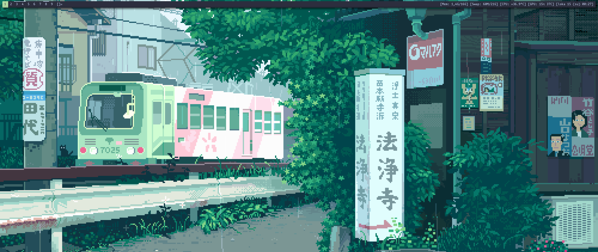
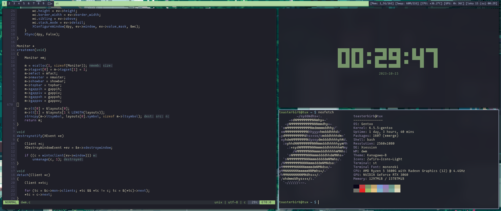

# dwm

This is my personal fork of [dwm](https://dwm.suckless.org/) with some patches applied and other modifications I deemed beneficial to my workflow.

The following patches are required in dmenu:
- [xyw](https://tools.suckless.org/dmenu/patches/xyw/)

## Screenshots

## Configuration
Most of the settings are configured the classic dwm way by editing the *config.h* file. In this fork however the colors are edited by modifying the *theme.h* file. This makes it possible to have multiple colorschemes while keeping things like keybinds etc. separate. The default colorscheme is included in the *theme.def.h* file that gets copied into *theme.h* that you can then edit (unless you want to change the defaults for some reason).

## Patches
The following patches have been applied. Do note though that there might be some changes to the code included in the patches, so you might not find them word to word in this fork. However, you can expect *most* of the functionality included in these patches to be included in this fork, though some of the patches might be repurposed for something they were not originally made for.

- [actualfullscreen](https://dwm.suckless.org/patches/actualfullscreen/dwm-actualfullscreen-20211013-cb3f58a.diff)
- [bar height](https://dwm.suckless.org/patches/bar_height/dwm-bar-height-6.2.diff)
- [barpadding](https://dwm.suckless.org/patches/barpadding/dwm-barpadding-20211020-a786211.diff)
- [colorbar](https://dwm.suckless.org/patches/colorbar/dwm-colorbar-6.3.diff)
- [fixborders](https://dwm.suckless.org/patches/alpha/dwm-fixborders-6.2.diff)
- [keycodes](https://dwm.suckless.org/patches/keycodes/dwm-keycodes-6.4.diff)
- [rotatestack](https://dwm.suckless.org/patches/rotatestack/dwm-rotatestack-20161021-ab9571b.diff)
- [steam](https://dwm.suckless.org/patches/steam/dwm-steam-6.2.diff)
- [vanitygaps](https://dwm.suckless.org/patches/vanitygaps/dwm-vanitygaps-20200610-f09418b.diff)
- [togglebartag](https://dwm.suckless.org/patches/togglebartag/togglebartag-20230421-e81f17d.diff)
